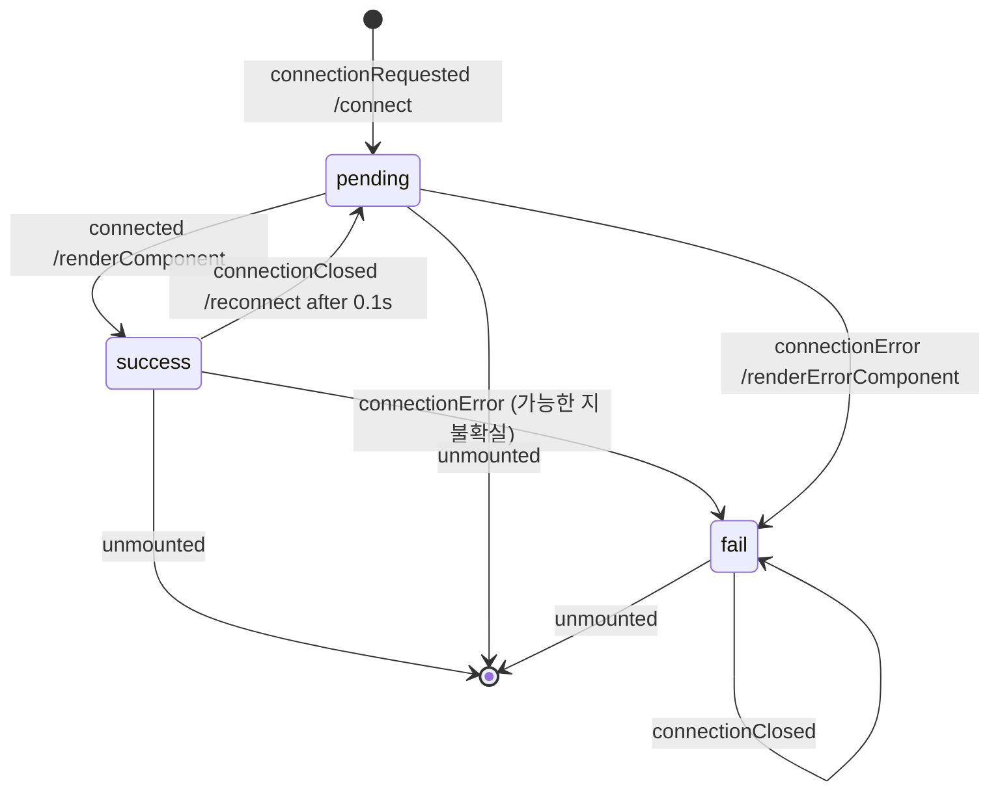

# 웹소켓 상태 다이어그램

## 이벤트 종류
- connectionRequested
  - 주체: 웹소켓이 필요한 컴포넌트.
  - 시점: 컴포넌트 마운트 시.
- unmounted
  - 주체: 웹소켓이 필요한 컴포넌트.
  - 시점: 컴포넌트 언마운트 시.
- connected: stomp client가 발행. 
  - 주체: stomp client.
  - 시점: stomp connection 요청 성공 시(onWebsocketConnected).
- connectionError: 
  - 주체: stomp client.
  - 시점: stomp connection 요청 실패했을 때(onWebsocketError). 그 외의 케이스가 있는 지 불확실.
- connectionClosed: stomp client가 발행. 
  - 주체: stomp client.
  - 시점:
    - 연결 중인 웹소켓으로 heartbeat 요청이 오가지 않을 때(주로 브라우저 탭 비활성화 시).
    - stomp connection 요청이 실패해서 에러가 발생한 후에(connectionError 직후).
    - 웹소켓 구독을 의도적으로 끊을 때.

## 추가 설명: 아래처럼 websocket close - connect가 계속 발생하는 이유

1. 탭이 비활성화되어 있으면 브라우저가 서버에 heartbeat 메시지를 보내지 않음
2. 브라우저가 heartbeat를 보내지 않으면, 1분 정도 후에 자동으로 connectionClosed 발생(서버에서 자동으로 닫는 것으로 보이나 블확실)
3. connectionError가 아니라 connectionClosed이므로 자동 reconnect

위와 같은 흐름으로 발생하는 정상 동작입니다. 콘솔에 찍히는 메시지는 디버깅 시 stomp client 내부 동작을 확인하기 위한 것으로 안정화 이후에 지울 예정입니다.
